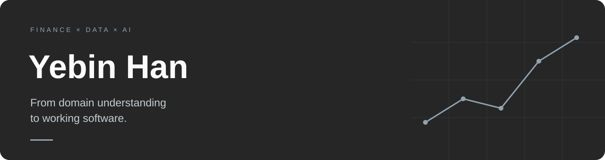

**재무의 논리를 이해하고, 데이터와 AI로 업무 흐름을 구현합니다.**

Economics · Business Administration · Information Statistics

[ValuFlow](https://github.com/codeek-ybHan/ValuFlow) &nbsp; / &nbsp; [Research Automation](https://github.com/codeek-ybHan/valuation-career-automation) &nbsp; / &nbsp; [일로ON](https://github.com/codeek-ybHan/illo-on)

 

## About

경제학·경영학·정보통계학을 공부하며 쌓은 도메인 이해를 바탕으로, 반복되는 업무를 분석하고 소프트웨어로 구현합니다.  
현재 재무제표 분석과 기업가치평가를 학습하며 **가치평가 업무지원 Workspace, ValuFlow**를 개발하고 있습니다.

- **Focus** — Financial Analysis · Valuation · AI Workflow Automation
- **Learning** — DCF · WACC · RAG · Agent · Tool Calling
- **Training** — SKALA · Web, Data, Cloud & AI

 

## Selected Projects

### 01 &nbsp; [ValuFlow](https://github.com/codeek-ybHan/ValuFlow)
**From Financial Statements to AI-powered Valuation.**

재무제표에서 재무분석, FCFF·WACC·DCF로 이어지는 가치평가 흐름을 학습 도구와 업무 화면으로 구현하는 프로젝트입니다.

- 재무분석·가치평가 학습 콘텐츠와 학습용 계산기 구현
- 공시 기반 Historical Data와 학습용 가정을 구분
- 계산 로직과 UI 분리, AI가 계산 엔진을 호출하는 구조로 확장 계획

`TypeScript` `Financial Analysis` `DCF / WACC`  
개발 진행 중 · 업무 화면의 계산 엔진 연결, AI Analyst 및 보고서 자동화로 확장 예정

 

### 02 &nbsp; [Valuation Career Automation](https://github.com/codeek-ybHan/valuation-career-automation)
**뉴스와 공시를 가치평가 학습으로 연결하는 리서치 파이프라인.**

뉴스·공시 수집부터 가치평가 관점 분석, 학습 포인트·퀴즈 생성, Notion 저장과 이메일 발송까지 연결합니다.

- Pydantic 기반 Structured Output으로 AI 출력 형식 정의
- 원문 출처 보존과 처리 이력 기반 중복 방지
- 수집·분석·저장·발송 단계 분리, 단계별 오류 처리

`Python` `OpenAI API` `OpenDART` `Notion / Gmail API` `GitHub Actions`

 

### 03 &nbsp; [일로ON](https://github.com/codeek-ybHan/illo-on)
**회의에서 결정된 일을 실제 업무 실행으로 연결합니다.**

회의 내용을 AI로 분석하고, 사용자가 검토한 Action Point를 Task·Sprint로 연결하는 업무관리 서비스입니다.

- 회의·메신저 내용 분석 → Action Point → 사용자 검토 → 업무 등록
- Task에서 관련 회의로 이동해 업무 생성 맥락 추적
- JWT 인증, REST API, Docker Compose 기반 서비스 구성

`Vue` `Java` `Spring Boot` `Spring AI` `MySQL` `Docker`

 

## Toolbox

| Area | Technologies |
| :--- | :--- |
| **Languages** | Python · Java · TypeScript · JavaScript · SQL |
| **Web & Backend** | Vue · Spring Boot · REST API |
| **Data** | PostgreSQL · MySQL · SQLite |
| **AI & Automation** | OpenAI API · Structured Output · API Integration |
| **Infrastructure** | Git · Docker · GitHub Actions |

 

## Building Principles

**도메인부터 이해합니다.**  
자동화할 업무의 흐름과 계산 근거를 먼저 정리합니다.

**계산과 해석을 분리합니다.**  
재무 계산은 검증 가능한 로직으로, AI는 정보 정리와 해석 지원에 활용합니다.

**검토 가능한 결과를 만듭니다.**  
데이터 출처와 가정을 남기고, 사용자의 판단이 필요한 지점을 분명히 합니다.

---

Understand the domain. Build the workflow. Make it useful.

